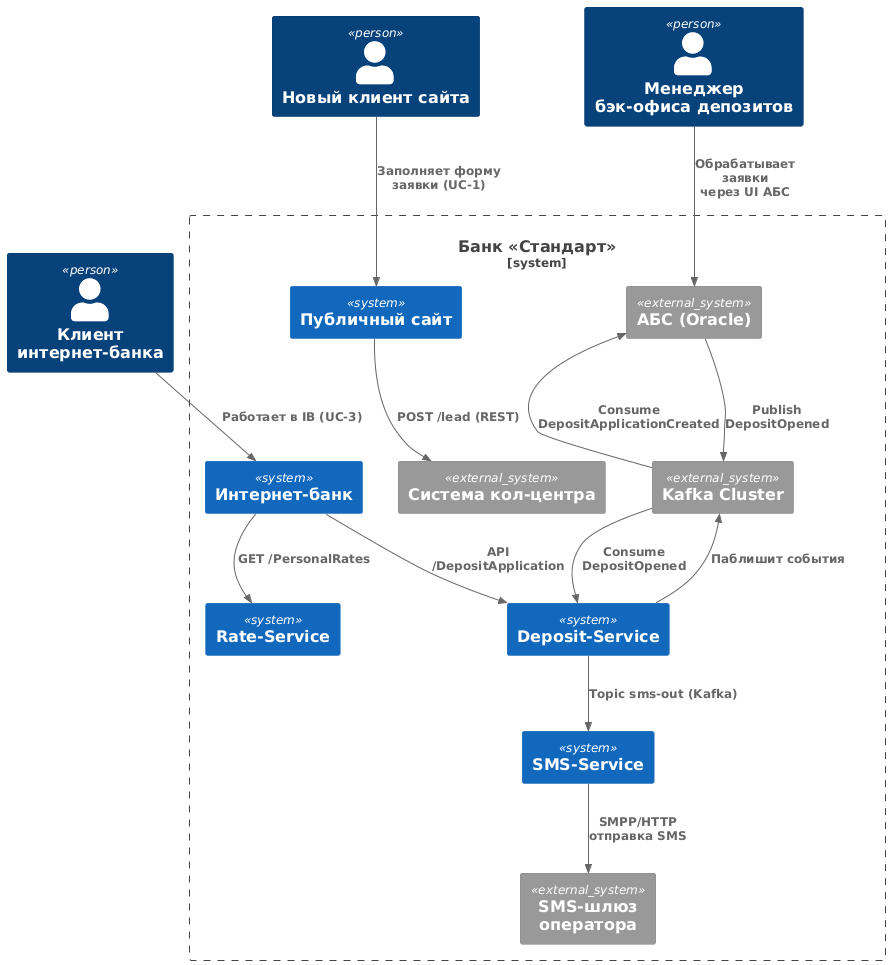
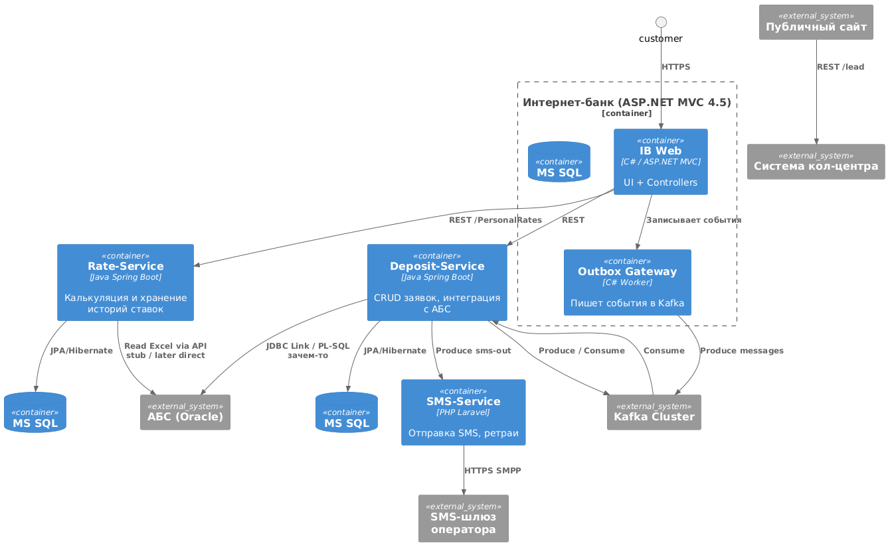

### **Название задачи: ADR-0003 MVP «Открытие депозита онлайн»** 
### **Автор: Шереметьев Владислав**
### **Дата: 06.08.2025**
### **Функциональные требования**

| **№** |               **Действующие лица или системы**               |            **Use Case**            |                                                                                                                                                                                                     **Описание**                                                                                                                                                                                                      |
| :---: | ------------------------------------------------------------ | ---------------------------------- | --------------------------------------------------------------------------------------------------------------------------------------------------------------------------------------------------------------------------------------------------------------------------------------------------------------------------------------------------------------------------------------------------------------------- |
| UC-1  | Потенциальный клиент, **Сайт**, **Система кол-центра**       | Подача заявки на депозит с сайта   | 1. Клиент открывает лендинг депозитов и видит список продуктов с актуальными ставками. 2. Вводит Ф. И. О. и номер телефона и нажимает «Отправить». 3. Сайт создаёт заявку в системе кол-центра (REST) и показывает экран «Мы перезвоним».                                                                                                                                                                       |
| UC-2  | Оператор, **Система кол-центра**, **Rate-Service**           | Обработка заявки кол-центром       | 1. Оператор видит новую заявку. 2. Нажимает «Рассчитать спец-ставку»; система запрашивает Rate-Service и выводит результат. 3. Оператор созванивается с клиентом, фиксирует итоговую ставку и статус звонка.                                                                                                                                                                                                    |
| UC-3  | Клиент-IB, **Интернет-банк**, **Rate-Service**, **SMS-шлюз** | Заявка на депозит в интернет-банке | 1. Авторизованный клиент открывает раздел «Депозиты»; интернет-банк запрашивает персональные ставки. 2. Клиент выбирает счёт-источник, сумму и нажимает «Оформить». 3. Браузер вызывает API Deposit-Service → создаётся заявка (status = NEW). 4. Клиент подтверждает операцию SMS-кодом (OTP). 5. Deposit-Service переводит статус заявки в **PENDING** и публикует событие `DepositApplicationCreated`. |
| UC-4  | Менеджер бэк-офиса депозитов, **АБС**, **Deposit-Service**   | Подтверждение и открытие депозита  | 1. Менеджер работает в АБС и видит новую заявку (интеграция через DB-link). 2. Проверяет клиентские данные и подтверждает заявку. 3. АБС автоматически создаёт договор депозита и публикует событие `DepositOpened` (Kafka). 4. Deposit-Service меняет статус на **COMPLETED** и инициирует SMS «Депозит открыт».                                                                                            |
| UC-5  | **SMS-шлюз**, Клиент                                         | Рассылка уведомлений               | 1. Deposit-Service формирует сообщение, кладёт его в Topic `sms-out`. 2. SMS-Service (PHP/Laravel) берёт событие, вызывает шлюз оператора, обрабатывает ретраи. 3. Клиент получает SMS.                                                                                                                                                                                                                         |

### **Нефункциональные требования**

| **№** |                                              **Требование**                                               |
| :---: | --------------------------------------------------------------------------------------------------------- |
|  R1   | SLA доступности 99,9 % для сайта и IB, RTO ≤ 15 мин (см. R1–R2)                                           |
|  P1   | TAPI 95 % ≤ 200 мс, FCP ≤ 1 с (P1–P2, U2)                                                      |
|  S1   | Технологические стандарты: ASP.NET MVC 4.5, Java Spring Boot, React, Kafka, MS SQL / Oracle (S1, S4, +R1) |
|  S3   | OpenAPI 3.0 + автогенерация SDK (S3)                                                                      |
|  +R3  | IB не обращается к АБС напрямую; используется шлюз / асинхронная шина                                     |
|  +R4  | Outbox-pattern для связи IB ↔ Kafka (совместимость со старой версией)                                     |
|  +R5  | АБС масштабируется вертикально; кэш + асинхронность в новых сервисах                                      |

### **Решение**

#### Ключевые идеи

* **Анти-direct-DB**: убираем прямое подключение IB к Oracle-БД АБС (треб. +R3) — вместо этого вводим **Deposit-Service** (Java Spring Boot) и **Rate-Service** (Java Spring Boot).
* **Асинхронность**: все изменения статуса заявок и депозита публикуются в Kafka. Это разгружает АБС и обеспечивает горизонтальное масштабирование фронтов IB (P2, +R5).
* **Outbox/gateway** между старым ASP.NET-монолитом IB и Kafka, чтобы не модифицировать ядро .NET 4.5 (+R4).
* **Single-Page Front** для сайта на существующем PHP+React хостинге (+R2) — минимальные изменения.
* **SMS-Service** выносится в отдельный лёгкий микросервис на PHP/Laravel (существующая экспертиза, F5).
* **БД**:

  * MS SQL — IB-Domain (заявки), т.к. стэк IB;
  * Oracle — АБС (договоры, счета);
  * В Rate-Service храним кэш ставок в MS SQL, а расчёт правилами в Java (перспектива вынести в Drools/DMN).
* **Инфраструктура**: k8s-кластеры в обоих ЦОД-ах; балансировка L7 + GeoDNS (P3, R2).
* **Набор автоматических тестов** в GitLab CI / Azure DevOps (S2).

#### Диаграммы C4

#### Логика выбора решений

1. **Разделение доменов.** Всё, что связано с пользовательским флоу IB и сайтом, вынесено из АБС в отдельные микросервисы, чтобы не увеличивать нагрузку на Oracle-БД (треб. +R3, +R5).
2. **Kafka + Outbox.** Позволяет IB-монолиту остаться на старом стекe .NET 4.5 — изменения минимальны, а единая шина сообщений удовлетворяет стратегическому требованию S4.
3. **Rate-Service.** Избавляемся от Excel; модуль делает расчёт ставок и выдаёт их и операторам, и IB.
4. **Fail-over 2 ЦОД.** Актив-актив балансировка + кэширование ставок + асинхронная обработка заявок → выполняем R1, P2 и не грузим АБС напрямую.
5. **SMS-Service отдельный.** Лёгкая PHP-утилита, не тратим время Java-команды, при этом выполняем ретраи и правило R3.

### **Альтернативы**

| Альтернатива                                       | Почему отклонили                                                                              |
| -------------------------------------------------- | --------------------------------------------------------------------------------------------- |
| **a)** Дать IB прямой REST-доступ к АБС            | Нарушает +R3, увеличивает нагрузку на Oracle → не выполняется R1.                             |
| **b)** Хранить ставки в Oracle-таблицах внутри АБС | Смешение доменов, сложнее менять формулу расчёта, нельзя гибко давать спец-ставки кол-центру. |
| **c)** Использовать gRPC вместо Kafka + REST       | Нет экспертизы, придётся пилить gatеways для старых .NET- и PHP-систем, повышает риск.        |

**Недостатки, ограничения, риски**

1. **Точка отказа — Kafka.** При недоступности кластера новые заявки буферизуются в Outbox-таблице; нужен мониторинг lag.
2. **IZ02.** Deposit-Service использует DB-link / stored-procedure к Oracle; при миграции АБС API потребуется рефакторинг.
3. **Две БД MS SQL.** Появляется саппорт-затрат на резервирование/бэкапы второй базы.
4. **Экстремальный рост трафика SMS.** Может потребовать расширения квоты у оператора (риск по R1).
5. **Legacy C# 4.5.** Пока не трогаем ядро IB; полная миграция на .NET 6/8 нужна в стратегической дорожной карте.

