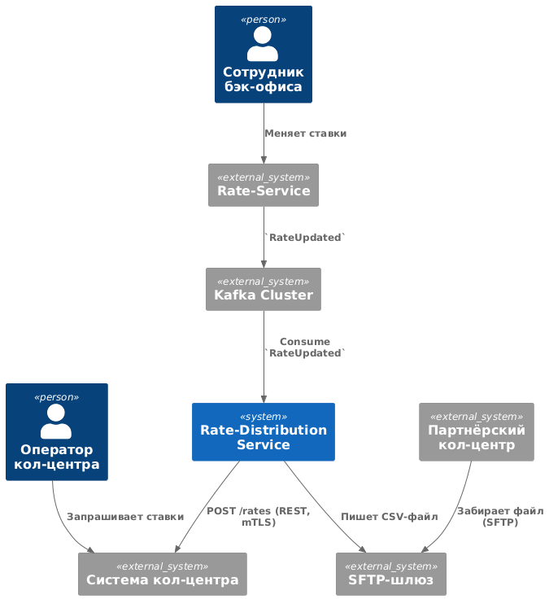
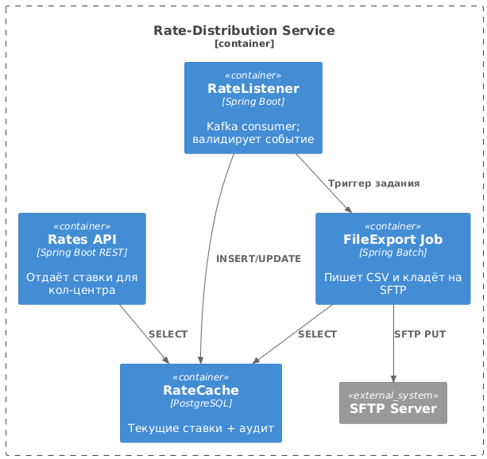

### **Название задачи: ADR-0004 «Передача ставок в кол-центр»** 
### **Автор: Шереметьев Владислав**
### **Дата: 06.08.2025**
### **Функциональные требования**

| **№** |                  **Действующие лица или системы**                   |        **Use Case**        |                                                                                                                                                                                  **Описание**                                                                                                                                                                                  |
| :---: | ------------------------------------------------------------------- | -------------------------- | ------------------------------------------------------------------------------------------------------------------------------------------------------------------------------------------------------------------------------------------------------------------------------------------------------------------------------------------------------------------------------ |
| UC-1  | Оператор банка, **Система кол-центра**                              | Просмотр актуальных ставок | 1. Оператор открывает карточку клиента. 2. Система кол-центра запрашивает последние ставки у **Rate-Distribution API**. 3. Оператор озвучивает клиенту подходящую ставку и фиксирует результат звонка.                                                                                                                                                                   |
| UC-2  | **Rate-Service**, **Rate-Distribution Service**                     | Публикация новой ставки    | 1. Сотрудник бэк-офиса меняет или подтверждает ставки в Rate-Service (процесс из MVP). 2. Rate-Service публикует событие `RateUpdated` (Kafka). 3. Rate-Distribution Service получает событие и: &nbsp;&nbsp;a) пушит JSON-объект ставок в **Систему кол-центра** по REST; &nbsp;&nbsp;b) формирует CSV-файл и кладёт его на SFTP-каталог партнёрского кол-центра. |
| UC-3  | **Партнёрский кол-центр**, SFTP-шлюз                                | Импорт ставок по файлу     | 1. По расписанию партнёрский кол-центр забирает CSV-файл «rates-YYYYMMDD-hhmm.csv». 2. Система партнёра парсит файл и обновляет собственный справочник.                                                                                                                                                                                                                     |
| UC-4  | DevOps-инженер, **Rate-Distribution Service**, Grafana/Alertmanager | Мониторинг и оповещения    | 1. Сервис ведёт метрики (кол-во событий, ошибки SFTP/REST, задержка Tlag). 2. В случае сбоя DevOps получает alert.                                                                                                                                                                                                                                               |

### **Нефункциональные требования**

|**№**|**Требование**|
| :---: | -------------- |
| R1 | SLA доставки ставок до обеих кол-центров ≤ 5 мин после обновления (99,5 %). |
| R2 | Доступность Rate-Distribution Service и SFTP-шлюза ≥ 99,9 %. |
| S1 | Используем существующие стеки: Java Spring Boot, Kafka, PostgreSQL, React, PHP. |
| S2 | Формат файла — CSV (UTF-8); размер ≤ 1 МБ; имя `rates-YYYYMMDD-hhmm.csv`. |
| S3 | Трафик SFTP шифруется SSH-ключами банка; REST-запросы защищены mTLS. |
| P1 | TAPI 95 % Rate-Distribution API ≤ 150 мс. |
| +R1 | Систему партнёрского кол-центра менять нельзя; допускается только SFTP-фид. |
| +R2 | Rate-Service уже публикует события в Kafka (ADR-0003); менять контракт нельзя. |

### **Решение**

#### Ключевые идеи

* **Переиспользуем Kafka-событие** `RateUpdated`, уже добавленное в ADR-0003 → нет изменений в Rate-Service (S1, +R2).
* **Single-purpose микросервис** Rate-Distribution снижает связанность: при дальнейших изменениях call-центров затрагивается только он.
* **REST + mTLS** покрывает внутреннюю интеграцию; **SFTP** ‒ единственный приемлемый способ для внешнего партнёра (+R1).
* **CSV** формируется сразу после события, но на SFTP кладётся атомарно (tmp-файл → rename) → исключаем нечитаемые каталоги.
* **Хранение копии ставок** (RateCache) позволяет операторам видеть историю и избавляет от повторных запросов к Rate-Service, удерживая SLA 5 мин.
* **Мониторинг** — стандартные микрометрики Spring + Prometheus + Grafana; алерты по SLA (UC-4).

#### Диаграммы C4

### **Альтернативы**

| Альтернатива                                                    | Почему отклонена                                                                             |
| --------------------------------------------------------------- | -------------------------------------------------------------------------------------------- |
| **a)** Прямой REST-запрос кол-центра к Rate-Service по требованию   | Нарушает R1 (доставка ≤ 5 мин), увеличивает нагрузку на Rate-Service, нет истории изменений. |
| **b)** Расширить Rate-Service, добавив файл-экспорт и REST-endpoint | Смешение доменов, усложняет сервис расчёта ставок, делает релизы зависимыми.                 |
| **c)** Использовать MQTT / gRPC вместо Kafka / REST                 | Нет экспертизы, повышает риски сроков; партнёр всё равно требует файл.                       |

**Недостатки, ограничения, риски**

1. **SFTP – SPOF**: при отказе шлюза нарушится доставка файлов — нужен горячий стенд.
2. **Событийный шторм** при массовой перекалибровке ставок → шип CSV каждые N секунд; mitigated батч-агрегацией (coalesce ≤ 30 сек).
3. **Дублирование ставок** (Rate-Service vs RateCache) потребует стратегии миграции при изменении модели.
4. **Security**: необходимо периодически ротацировать SSH-ключи партнёра.

